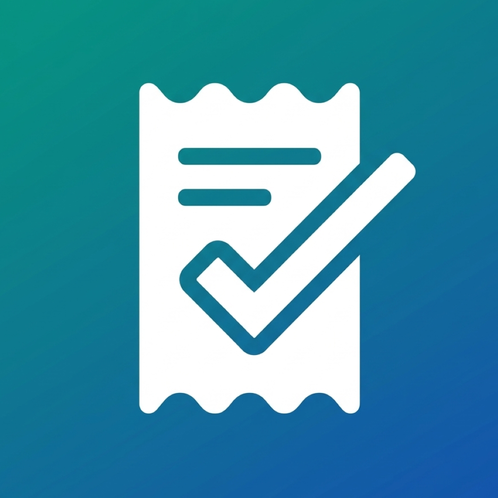

# <picture></picture> BillTracker 

BillTracker is an Android app built with React Native and Expo for tracking bills and contracts entirely on-device. All data stays in a local SQLite database.

## What It Does

- **Quick bills** — add one-time bills (doctor visit, tax notice, repair) directly from the home screen without creating a contract
- **Recurring contracts** — set up providers with billing cycle, amount, and dates; the app auto-generates upcoming bills each cycle
- **Providers** — the app remembers provider names across bills and contracts with autocomplete suggestions
- **Editable amounts** — change the amount on any individual bill (useful for variable bills like electricity) while keeping the contract default as reference
- **Proof of payment** — attach a scanned receipt or imported PDF to any bill
- **Contract documents** — store signed agreements and PDFs on contracts
- **Search** — filter contracts and providers from the Contracts screen search bar
- **Backups** — export all data (including proof files) as a ZIP and restore from backup
- **Reminders** — local push notifications before due dates, on due dates, and for overdue bills
- **Localization** — English and German, with locale-aware date formatting
- **Theming** — system, light, and dark mode

## Repository Layout

The mobile app lives in `app/`.

```
app/
  App.tsx                         Root component, theme/language/onboarding init
  src/
    screens/                      App screens
      HomeScreen.tsx              Upcoming bills with summary card
      ContractsScreen.tsx         Contracts list with search + standalone providers
      ContractDetailScreen.tsx    Contract info, documents, and bill list
      BillDetailScreen.tsx        Bill info, editable amount, proof, payment actions
      AddEditContractScreen.tsx   Create / edit contracts
      AddBillScreen.tsx           Add quick bill or bill from contract
      ProviderDetailScreen.tsx    Bill history for standalone providers
      SettingsScreen.tsx          Language, theme, currency, reminders, backup
      OnboardingScreen.tsx        Setup wizard with feature tour
    components/                   Reusable UI (BillListItem, ContractCard, etc.)
    database/
      schema.ts                   Table definitions and migrations
      db.ts                       All CRUD operations
    services/
      billGeneration.ts           Auto-generate bills from contracts
      exportImport.ts             ZIP backup and restore
      notifications.ts            Local push notification scheduling
    localization/
      i18n.ts                     i18next setup
      en.json                     English strings
      de.json                     German strings
    types/index.ts                TypeScript interfaces and constants
    utils/date.ts                 Date formatting, billing date generation
    theme/index.ts                Material Design 3 light/dark themes
    navigation/AppNavigator.tsx   Bottom tabs + stack navigator
```

## Tech Stack

- React Native 0.81 with Expo SDK 54 (managed workflow)
- TypeScript (strict mode)
- SQLite via `expo-sqlite`
- React Navigation (bottom tabs + native stack)
- React Native Paper (Material Design 3)
- `i18next` / `react-i18next` for localization
- `date-fns` for date operations
- `expo-notifications` for local reminders
- `jszip` for ZIP backup/restore
- ML Kit document scanner (`@infinitered/react-native-mlkit-document-scanner`) for auto-cropped receipt scans

## Data Model

Four SQLite tables, all stored locally:

| Table | Purpose |
|---|---|
| `settings` | App configuration (language, theme, currency, reminders) |
| `contracts` | Recurring provider contracts with billing rules |
| `bills` | Individual bills — linked to a contract or standalone (one-time) |
| `contract_documents` | PDF/photo attachments on contracts |

Bills have a nullable `contract_id`. When set, the bill was auto-generated from a contract. When null, it's a standalone quick bill with its own `provider_name` and `category`.

## Getting Started

### Prerequisites

- Node.js 18+
- npm
- Android Studio / Android SDK (API 34+)
- An Expo dev build or Android device/emulator

### Install

```bash
cd app
npm install
```

### Run in Development

```bash
cd app
npx expo start
```

Connect via an Expo dev build on your device or emulator.


## Expo / SDK Notes

- Import `expo-file-system/legacy` (not the default export) for `documentDirectory`, `EncodingType`, etc.
- Use `SQLiteBindValue[]` for SQLite bind parameters
- Use `expo-crypto` `Crypto.randomUUID()` instead of the `uuid` library (no Web Crypto API in React Native)
- `expo-notifications`: use `shouldShowBanner: true, shouldShowList: true`; don't pass `channelId` in notification content
- Android date pickers use `@react-native-community/datetimepicker`

## License

This project is private and not currently published under an open-source license.
